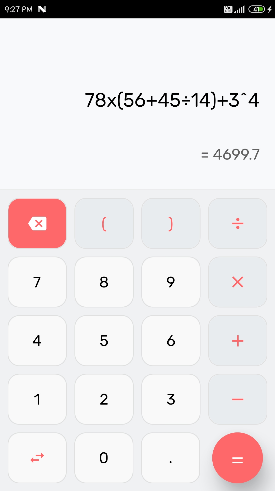
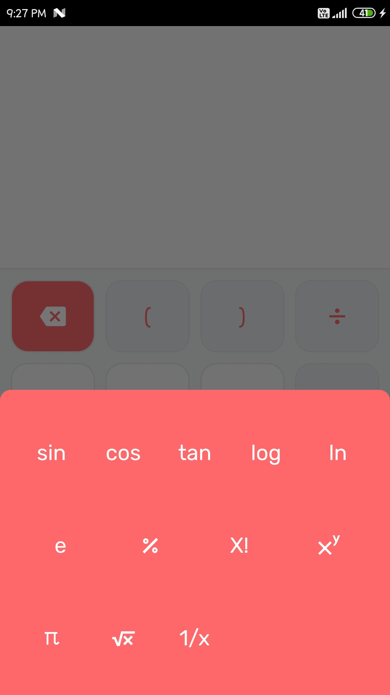

# Calculator

A calculator app made using Flutter.

The app can perform following operations:
- Trigonometric Functions (sin/cos/tan).
- Mathematical operations(+, -, x, ÷, root, inverse).
- Logarithms(log/ln)

Screenshots:

Main Screen:

---

Advanced options:

